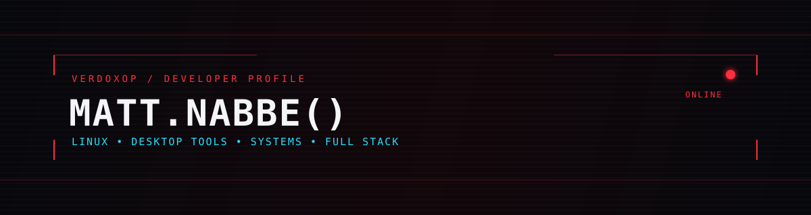

<div align="center">
  
</div>

---

<table style="width:100%;table-layout:fixed;"><tr>
<td width="600" valign="top">

```zsh
verdox@cachyos ~ $ cat about.conf
```
```ini
[me]
name   = Matt
handle = VerdoxOP
role   = IT Student · Developer

[stack]
os       = CachyOS (Arch) · Wayland · Hyprland
langs    = Rust · TypeScript · Java · C · C# · Go · Dart · Python · Lua
ui       = React.js · Next.js · Vue.js · TailwindCSS
native   = Tauri v2 · Vite · GTK4 · WebKitGTK
backend  = Java · Spring Boot · Rust
desktop  = Layer Shell · systemd user services · IPC
graphics = GLSL · desktop HUDs · native overlays
data     = PostgreSQL · MySQL · SQLite · Firebase · Isar
infra    = Docker · Kubernetes · GitHub Actions · Git
cloud    = AWS · Cloudflare

[field]
main    = Desktop Tooling · Full Stack · Systems Projects
current = C · Linux · building things from scratch
```

</td><td width="15">
  
</td></tr></table>

---

<div align="center">

```
┌──────────────────────────────────────────────────────────┐
│  "The only way to learn a new programming language is by  │
│   writing programs in it."                                │
│                                           — Dennis Ritchie │
└──────────────────────────────────────────────────────────┘
```

</div>

---

<div align="center">

## 

<a href="https://github.com/VerdoxOP/toy-lang"></a>
<a href="https://github.com/VerdoxOP/deskimon"></a>
<a href="https://github.com/VerdoxOP/hyprland-inspector"></a>

</div>

---

<div align="center">

## 

</div>

<details>
<summary><b>⌿ &nbsp;Languages & application development</b></summary><br/>
<p align="center"></p>
</details>

<details>
<summary><b>☁ &nbsp;Backend & data</b></summary><br/>
<p align="center"><br/><sub>Also using Isar for local-first data.</sub></p>
</details>

<details>
<summary><b>♾ &nbsp;Tools & desktop</b></summary><br/>
<p align="center"></p>
</details>

---

<div align="center">
  <a href="https://github.com/VerdoxOP?tab=repositories">[ browse all repositories ]</a>
  <br/><br/>
  <sub>VerdoxOP © 2026</sub>
</div>
